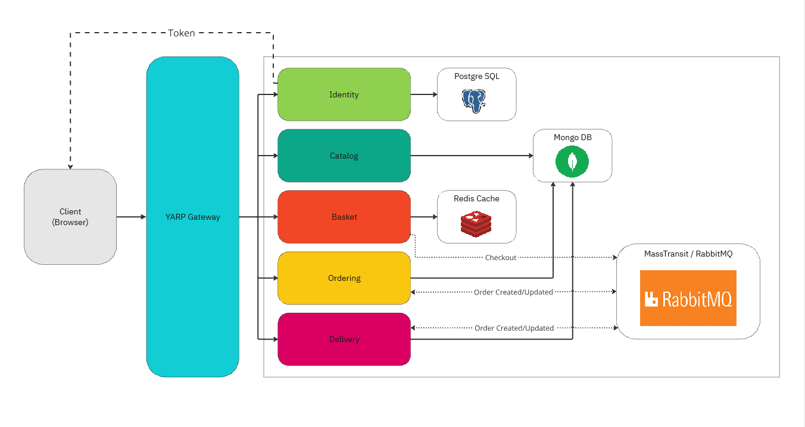

# Описание
Проект был создан для изучения микросервисной архитектуры. Приложение в данном проекте имитирует работу сервиса по заказу и доставке еды. Пользователь выбирает еду из каталога, оформляет заказ и далее отслеживает его статус в реальном времени (для этого применяется SignalR подключение). Все ключевые процессы разделены на отдельные микросервисы, которые передают информацию друг другу через MassTransit и RabbitMQ (сервисы независимы друг от друга, объекты для передачи представлены в виде DTO). Все запросы от пользователя к микросервисам перенаправляются посредством YARP.

# Схема проекта

- Запросы от пользователя перенаправляются через YARP
- Сервис `Identity` проводит аутентификацию пользователя и возвращает JWT токен, чтобы пользователь мог в дальнейшем сохранять корзину, отслеживать текущий заказ и просматривать историю заказов
- Сервис `Catalog` выгружает список товаров из БД и передаёт в клиент (браузер) пользователя для отображения
- Сервис `Basket` сохраняет корзину пользователя с товарами, при оформлении заказа имитирует списание платы и передаёт сообщение об оформлении заказа в сервис `Ordering` через RabbitMQ
- Сервис `Ordering` принимает заказ и имитирует его приготовление, далее меняет статус заказа и передаёт сообщение о готовности в сервис `Delivery`
- Сервис `Delivery` принимает сообщения о создании и изменении заказа, имитирует доставку заказа и меняет статус заказа на соответствующий

# Требования для запуска
1) Visual Studio 2022 (я использовал Preview версию и .Net 8)
2) Docker

# Запуск приложения
1) Клонировать репозиторий и открыть файл `.sln`
2) Запустить Docker, прописать в Package Manager Console команду: `docker compose up` (проверить в Docker, что все сервисы в контейнере запущены и работают)
3) Применить миграции EF Core для проекта Catalog (чтобы в каталоге заранее появились позиции для заказа), т. е. в Package Manager Console прописать `Apply Migration` и `Update Database` (выбрать Catalog как проект по умолчанию в окне консоли), то же сделать для проекта Identity (для создания тестового пользователя в БД)
4) В Visual Studio предварительно выбрать для запуска все проекты, кроме тестов
5) Запустить приложение, перейти на страницу: https://localhost:7047/
6) Войти по логину `+79012223344` и паролю `test` (можно создать отдельный аккаунт пользователя по кнопке `Регистрация`)

Для проверки транзакций между микросервисами можно войти в панель администрирования RabbitMQ по адресу http://localhost:15672/ с логином и паролем `guest`

# Что можно улучшить?
1) Улучшить UI
2) Добавить возможность оформить заказ без оплаты онлайн (как если бы пользователь оплачивал курьеру) и отменять заказ, если он ещё не был приготовлен
3) Добавить возможность повторить заказ из истории заказов
